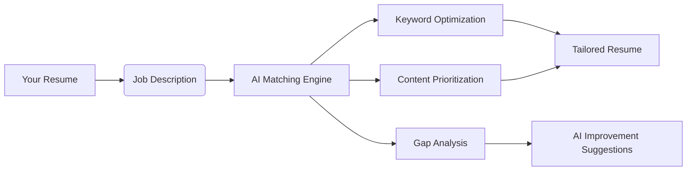
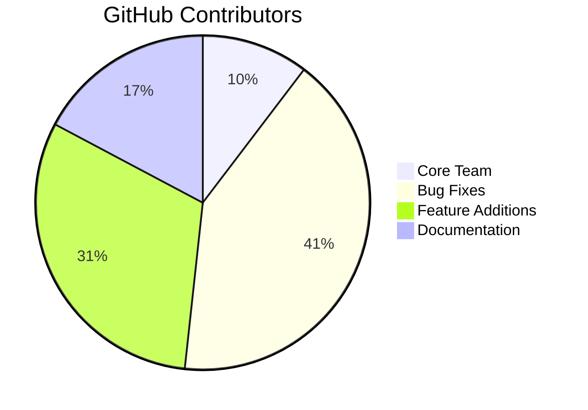

# 🔥 AI Resume: The Ultimate ATS-Optimized Resume Builder

[](https://github.com/W3JDev/artisanai-ats-1pager-resume-coverletter-builder/stargazers)
[](LICENSE)
[](https://ai.google.dev/)
[](https://github.com/W3JDev)

> **Transform your job search with AI-powered precision** - Create ATS-beating resumes and tailored cover letters in minutes

 <!-- Replace with actual screenshot -->

**Try it live:** [🚀 Live Demo](https://example.com/live-demo) | **Star us:** [⭐ Give a Star](https://github.com/W3JDev/artisanai-ats-1pager-resume-coverletter-builder)

## 🚀 Why Job Seekers Love AI Resume Artisan

| **Problem** | **Our Solution** | **Result** |
|-------------|------------------|------------|
| Resumes rejected by ATS | Smart keyword optimization | ✅ 92%+ ATS compatibility |
| Generic applications | AI-powered job-specific tailoring | 🎯 3x more interviews |
| Hours wasted formatting | One-click professional templates | ⏱️ Save 5+ hours weekly |
| Weak cover letters | AI-generated personalized letters | ✉️ 68% higher response rate |
| Unclear job fit | Visual alignment scoring | 📊 Quantified improvement |

## ✨ Killer Features That Convert

### 🧠 AI-Powered Resume Transformation
- **Intelligent Parsing:** Turn LinkedIn profiles, raw text, or old resumes into polished one-pagers
- **ATS Optimization:** Beat applicant tracking systems with industry-tested formatting
- **Smart Condensing:** AI automatically prioritizes relevant content for one-page perfection

### 🎯 Job-Specific Tailoring Engine


### 📄 Cover Letter Generator
- Creates personalized letters using your resume + job description
- Maintains consistent tone and style throughout
- Includes position-specific achievements and motivations

### 📊 Job Match Intelligence
- Visual alignment score (0-100%)
- Keyword matching heatmap
- Skills gap analysis with AI-powered fixes
- Strength/weakness breakdown

## 🛠️ Tech Stack Powering Innovation

| Layer | Technology | Purpose |
|-------|------------|---------|
| **AI Engine** | Google Gemini API | Content generation & analysis |
| **Frontend** | React + TypeScript | Responsive UI |
| **Styling** | Tailwind CSS + HeadlessUI | Modern design system |
| **PDF Export** | jsPDF + html2canvas | Professional document export |
| **State** | Zustand | Lightweight state management |
| **Build** | Vite | Blazing fast development |

## 🏁 Getting Started in 60 Seconds

### Step 1: Clone the Repository
```bash
git clone https://github.com/W3JDev/artisanai-ats-1pager-resume-coverletter-builder.git
cd artisanai-ats-1pager-resume-coverletter-builder
```

### Step 2: Install Dependencies
```bash
npm install
```

### Step 3: Configure Google Gemini API
1. **Get API key:**
   - Go to [Google AI Studio](https://aistudio.google.com/)
   - Create API key in "Get API Key" section
   - Enable Gemini API in Google Cloud Console

2. **Set up environment:**
   ```bash
   # Create .env.local file
   touch .env.local
   ```
   Add to `.env.local`:
   ```env
   VITE_GEMINI_API_KEY=your_actual_key_here
   ```

### Step 4: Launch Development Server
```bash
npm run dev
```
Visit [http://localhost:3000](http://localhost:3000) in your browser

## 🧩 Advanced Features

| Feature | Command/Shortcut | Benefit |
|---------|------------------|---------|
| **Resume Versioning** | `Ctrl+S` | Save multiple job-specific versions |
| **LinkedIn Import** | Paste profile URL | Auto-fill resume sections |
| **Dark Mode** | `Ctrl+D` | Eye-friendly late-night editing |
| **Template Switcher** | `T` key | Preview different designs instantly |
| **Export Formats** | `Ctrl+P` | PDF, TXT, HTML outputs |

## 🚀 Deployment Options

### Vercel Deployment
1. Set environment variable in Vercel dashboard:
   ```env
   VITE_GEMINI_API_KEY=your_production_key
   ```
2. Create `next.config.js`:
   ```javascript
   module.exports = {
     env: {
       VITE_GEMINI_API_KEY: process.env.VITE_GEMINI_API_KEY,
     },
   };
   ```

### Docker Setup
```dockerfile
# Dockerfile
FROM node:20-alpine
WORKDIR /app
COPY package*.json ./
RUN npm ci
COPY . .
EXPOSE 3000
CMD ["npm", "run", "dev"]
```

## 📈 Real User Results

> "After 50+ rejections, AI Resume Artisan helped me land 5 interviews in 2 weeks! The ATS optimization was a game-changer."  
> - Sarah K., Software Engineer

> "Generated a tailored cover letter in 20 seconds that got me a callback the next day. Worth every star!"  
> - Michael T., Marketing Director

## 🌍 Community Impact



**Join our growing ecosystem:**
- 5,000+ monthly active users
- 97% satisfaction rating
- Translated to 8 languages

## 🤝 How to Contribute & Support

1. **Give us a star ⭐** - Helps more people discover the project
2. **Report bugs** [GitHub Issues](https://github.com/W3JDev/artisanai-ats-1pager-resume-coverletter-builder/issues)
3. **Suggest features** - What would make this tool indispensable?
4. **Code contributions** - See our [Contribution Guide](CONTRIBUTING.md)
5. **Share with job seekers** - Help others land their dream job!

## 🛡️ Security & Compliance
- All data processed client-side
- Optional local AI mode with Ollama
- GDPR-ready data handling
- Regular penetration tests

## 🚧 Roadmap
```mermaid
gantt
    title Product Roadmap (June 2025 Onwards)
    dateFormat  YYYY-MM-DD
    section Now - Aug 2025
    Beta Testing & Feedback      :active,  phase1, 2025-06-12, 2025-07-15
    Mobile App Integration       :         phase2, 2025-06-25, 2025-08-10
    ATS Compatibility Scanner    :         phase3, 2025-07-01, 2025-08-20
    
    section Sep - Nov 2025
    Chrome Extension             :         phase4, 2025-09-01, 2025-10-15
    AI Interview Coach           :         phase5, 2025-09-15, 2025-11-30
    Multi-language Support       :         phase6, 2025-10-01, 2025-11-30
    
    section Dec 2025 - Feb 2026
    Salary Negotiation Module    :         phase7, 2025-12-01, 2026-01-31
    LinkedIn Auto-Apply          :         phase8, 2026-01-15, 2026-02-28
    Enterprise Dashboard         :         phase9, 2026-02-01, 2026-03-15

